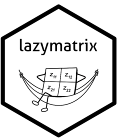

<!-- README.md is generated from README.Rmd. Please edit that file -->

```{r, include = FALSE}
knitr::opts_chunk$set(
  collapse = TRUE,
  comment = "#>",
  fig.path = "man/figures/README-",
  out.width = "100%"
)
```

# lazymatrix <a href="https://vsegersall.github.io/lazymatrix/"></a>

<!-- badges: start -->
[](https://github.com/vsegersall/lazymatrix/actions/workflows/R-CMD-check.yaml)
[](https://lifecycle.r-lib.org/articles/stages.html)
[](https://vsegersall.github.io/lazymatrix/)
<!-- badges: end -->

`lazymatrix` provides a framework for working with transformed sparse data matrices using [lazy evaluation](https://en.wikipedia.org/wiki/Lazy_evaluation). This approach is particularly useful for handling large sparse matrices where transformations (e.g., centering and scaling) would otherwise result in dense matrices, consuming significant memory and computational resources.

## Installation

You can install the development version of lazymatrix from [GitHub](https://github.com/) with:

``` r
# install.packages("pak")
pak::pak("vsegersall/lazymatrix")
```
Note: Once the package is accepted to CRAN, you can also install it via:
```{r, eval=FALSE}
install.packages("lazymatrix")
```

## Example

This is a basic example which shows you how to solve a common problem:

```{r example}
library(lazymatrix)
set.seed(123)
sparse_matrix <- Matrix::Matrix(0, 5, 3)
sparse_matrix[sample(length(sparse_matrix), 5)] <- rnorm(5)
b <- rnorm(3)
lazy_matrix <- LazyMatrix(sparse_matrix, scale = "sd", location = "mean")

print(lazy_matrix)
lazy_matrix %*% b
```

## Development Status
This package is currently in active development. While the core functionality is stable, the API may evolve as the project matures. Contributions are currently closed while the package is prepared for its first CRAN release. However, bug reports and feature requests are welcome via the GitHub Issue Tracker.