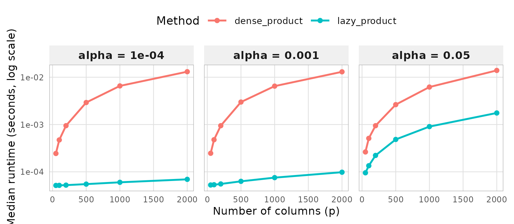
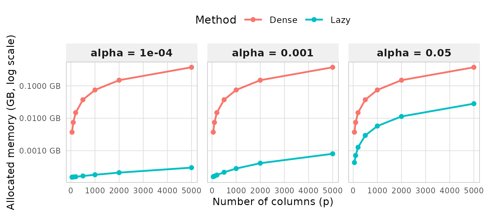

# performance

``` r

library(lazymatrix)
#> 
#> Attaching package: 'lazymatrix'
#> The following object is masked from 'package:base':
#> 
#>     norm
```

## Performance of `lazymatrix`

In this vignette, we discuss the main reason for lazy computation,
namely the increase in performance. Assume `X` as the sparse data matrix
containing fetures, `lazy_X` the `LazyMatrix` object and `A` is the
normalized version obtained using `base::scale(X)`. We use the package
`bench` to microbenchmark the computation time of matrix-vector
multiplication, hence comparing the operation `lazy_X%*%b` against
`A%*%b`. Thereafter, we look at memory allocation, where we compare
storing the `LazyMatrix` object and the normalized object.

### Helper Functions

For these experiment, we need a set of helper functions. As the main
use-case is working with sparse data, we define a helper forgenerating
sparse matrices `create_sparse_matrix_col()` which allows for adjusting
the parameter `sparsity_col` so the proportion of elements that are
non-zero within each column. For simplicity, this parameter will be
called $`\alpha`$, Then, we use the helper `bench_multiply()` where we
define the `LazyMatrix` object for the input matrix, normalize it and
then we benchmark matrix-vector multiplication. The function
`benchmark_memory()` is written in a similar way, though it uses
[`utils::object.size()`](https://rdrr.io/r/utils/object.size.html) to
measure memory allocation of an object, the lazy and the dense. Lastly,
two helper functions which are used for using consistent themes for
`ggplot2` throughout the vignette.

``` r

library(Matrix)
library(bench)
library(dplyr)
#> 
#> Attaching package: 'dplyr'
#> The following objects are masked from 'package:stats':
#> 
#>     filter, lag
#> The following objects are masked from 'package:base':
#> 
#>     intersect, setdiff, setequal, union
library(ggplot2)
#--------------------------------------------------
# Sparse matrix generator
#--------------------------------------------------
create_sparsematrix_col <- function(n, p, sparsity_col) {
  # sparsity_col = fraction of non-zeros PER COLUMN
  # So each column has round(sparsity_col * n) non-zero entries
  n_nonzero_col <- round(sparsity_col * n)

  i_all <- c()
  j_all <- c()

  for (col in 1:p) {
    i_col <- sample(1:n, n_nonzero_col, replace = FALSE)
    i_all <- c(i_all, i_col)
    j_all <- c(j_all, rep(col, n_nonzero_col))
  }

  pairs <- unique(data.frame(i = i_all, j = j_all))
  x     <- rnorm(nrow(pairs))

  Matrix::sparseMatrix(
    i    = pairs$i,
    j    = pairs$j,
    x    = x,
    dims = c(n, p)
  )
}

#--------------------------------------------------
# Benchmark function Computation Time
#--------------------------------------------------
bench_multiply <- function(sparse_matrix, b) {
  A <- scale(sparse_matrix, center = TRUE, scale = TRUE)
  X <- LazyMatrix(sparse_matrix, "sd", "mean")
  bench::mark(
    dense_product = { A %*% b },
    lazy_product  = { X %*% b },
    check         = FALSE,
    min_iterations = 20
  )
}

#--------------------------------------------------
# Benchmark function for Memory Allocation
#--------------------------------------------------

benchmark_memory <- function(M) {
  dense_size <- tryCatch({
    A_dense <- scale(as.matrix(M), center = TRUE, scale = TRUE)
    mem     <- as.numeric(utils::object.size(A_dense)) / 1024^2
    rm(A_dense); gc()
    data.frame(method = "Dense", success = TRUE, mem_MB = mem)
  }, error = function(e) {
    message("Dense error: ", e$message)
    data.frame(method = "Dense", success = FALSE, mem_MB = NA)
  })

  lazy_size <- tryCatch({
    X_lazy <- LazyMatrix(M, "sd", "mean")
    mem    <- as.numeric(utils::object.size(X_lazy)) / 1024^2
    rm(X_lazy); gc()
    data.frame(method = "Lazy", success = TRUE, mem_MB = mem)
  }, error = function(e) {
    message("Lazy error: ", e$message)
    data.frame(method = "Lazy", success = FALSE, mem_MB = NA)
  })

  bind_rows(dense_size, lazy_size)
}

#--------------------------------------------------
# Plot Theme used throughout the thesis for ggplot2
#--------------------------------------------------
thesis_theme <- function(base_size = 12) {
  theme(
    panel.background = element_rect(fill = "white", colour = NA),
    plot.background  = element_rect(fill = "white", colour = NA),
    panel.grid.major = element_line(colour = "grey85"),
    panel.grid.minor = element_line(colour = "grey92"),
    panel.border     = element_rect(colour = "black", fill = NA, linewidth = 0.8),
    text             = element_text(size = base_size),
    axis.text        = element_text(size = rel(1.01)),
    axis.text.x      = element_text(size = rel(1.01), angle = 45, hjust = 1)
  )
}

#--------------------------------------------------
# Plot Theme used throughout vignettes for ggplot2
#--------------------------------------------------

vignette_theme <- function(base_size = 12) {
  theme_minimal(base_size = base_size) +
  theme(
    # Subtle background strip for facet labels
    strip.background  = element_rect(fill = "#f0f0f0", colour = NA),
    strip.text        = element_text(face = "bold", size = rel(0.95)),

    # Thin, unobtrusive grid
    panel.grid.major  = element_line(colour = "grey88", linewidth = 0.4),
    panel.grid.minor  = element_blank(),

    # Light border just around facet panels
    panel.border      = element_rect(colour = "grey70", fill = NA, linewidth = 0.5),
    panel.spacing     = unit(0.8, "lines"),

    # Legend inside or on top saves horizontal space in HTML
    legend.position   = "top",
    legend.key.width  = unit(1.8, "lines"),

    # Axis: no need to rotate if labels are short
    axis.text.x       = element_text(size = rel(0.9)),
    axis.text.y       = element_text(size = rel(0.9)),
    axis.title        = element_text(size = rel(0.95)),

    plot.margin       = margin(8, 12, 8, 8)
  )
}
```

### Results of Computation Time Benchmark

We run the experiment as follows: let `n` be the number of rows of the
sparse matrix which we let be constant for all matrices at `n <- 10000`.
In statistics, the number of rows usually denotes the number of
observations and the columns the features. Hence, letting `n` be
constant and augmenting the columns `p` reflects the experiment of
adding features to an existing dataset. Apart from dimensionality, the
experiment also depends on sparsity, so the proportion of non-zero
elements for every column. We test for three levels of sparsity, 5 %,
0.1 % and 0.01 %. A rule of thumb when working with sparse matrices, is
that the larger the dimensionality, the lesser the sparsity usually.

Then, we run the benchmark function for matrix-vector multiplication
defined above for every `p` and every `sparsity`. The results are
therafter translated into seconds and we keep them in a tibble which is
used to graph the result.

``` r

#--------------------------------------------------
# Parameters (smaller for testing)
#--------------------------------------------------
n              <- 10000
sparsity_cols  <- c(0.05, 0.001, 0.0001)
p_values       <- c(50, 100, 200, 500, 1000, 2000)

#--------------------------------------------------
# Run benchmarks
#--------------------------------------------------
results <- list()
counter <- 1

for (sc in sparsity_cols) {
  cat("Running sparsity_col =", sc, "\n")
  for (p in p_values) {
    cat("  p =", p, "\n")

    M  <- create_sparsematrix_col(n = n, p = p, sparsity_col = sc)
    b  <- rnorm(p)
    bm <- bench_multiply(M, b)

    tmp <- bm %>%
      select(expression, min, median, mem_alloc) %>%
      mutate(sparsity_col = sc, n = n, p = p)

    results[[counter]] <- tmp
    counter <- counter + 1
    rm(M); gc()
  }
}
#> Running sparsity_col = 0.05 
#>   p = 50 
#>   p = 100 
#>   p = 200 
#>   p = 500 
#>   p = 1000 
#>   p = 2000 
#> Running sparsity_col = 0.001 
#>   p = 50 
#>   p = 100 
#>   p = 200 
#>   p = 500 
#>   p = 1000 
#>   p = 2000 
#> Running sparsity_col = 1e-04 
#>   p = 50 
#>   p = 100 
#>   p = 200 
#>   p = 500 
#>   p = 1000 
#>   p = 2000

#--------------------------------------------------
# Process results
#--------------------------------------------------
benchmark_results <- bind_rows(results) %>%
  mutate(
    method     = as.character(expression),
    median_sec = as.numeric(median),
    min_sec    = as.numeric(min)
  )
```

The results are presented in the following plot.

``` r

#--------------------------------------------------
# Plot for computation time
#--------------------------------------------------
ggplot(
  benchmark_results %>%
    mutate(sc_label = factor(
      paste0("alpha = ", sparsity_col),
      levels = paste0("alpha = ", sort(unique(sparsity_col)))
    )),
  aes(x = p, y = median_sec, color = method, group = method)
) +
  geom_line(linewidth = 1) +
  geom_point(size = 2) +
  scale_y_log10() +
  facet_wrap(~ sc_label, nrow = 1) +
  labs(
    x     = "Number of columns (p)",
    y     = "Median runtime (seconds, log scale)",
    color = "Method"
  ) +
  vignette_theme(13)
```



Each facet corresponds to a sparsity level, with the logarithm of median
runtime on the vertical axis and the number of features $`p`$ on the
horizontal axis. The red line represents the dense computation while the
blue is the lazy computation. Looking at the figure, we note that dense
computation requires $`O(np)`$ operations for the centering step,
regardless of sparsity, since every element must be explicitly centered.
This is confirmed in the plot, where the dense curve is identical across
all three facets, increasing only with $`p`$. The blue line representing
the lazy computation however, shows clearly that computation time
decreases as $`\alpha`$ gets lower. For $`\alpha=0.05`$, the trend is
similar to that of the dense computation, in the sense that as
dimensionality gets higher, so does computation time. This follows from
the $`O(k + p)`$ complexity of lazy computation, which approaches
$`O(np)`$ as $`\alpha`$ increases. Conversely, as sparsity decreases and
$`k \ll np`$, the computational advantage of lazy evaluation becomes
clear. Lazy computation exploits sparsity by operating only over the
$`k`$ non-zero entries, avoiding the redundant computation on
zero-valued elements that dense methods perform. Hence, the lazy
computation gets better the sparser the matrix is, and also better the
higher the dimensionality compared to dense methods.

### Results of Memory Benchmark

The benchmark experiment is similar to that of computation time. We let
$`n`$ be constant, augment $`p`$ and test for three levels of sparsity.
Here, the measurements we make is the amount of memory used for storing
the different objects.

``` r

#--------------------------------------------------
# Parameters
#--------------------------------------------------
n              <- 10000
sparsity_cols  <- c(0.05, 0.001, 0.0001)
p_values       <- c(50, 100, 200, 500, 1000, 2000, 5000)

#--------------------------------------------------
# Process results
#--------------------------------------------------
results <- list()
counter <- 1

for (sc in sparsity_cols) {
  cat("Running sparsity_col =", sc, "\n")
  for (p in p_values) {
    cat("  p =", p, "\n")

    M       <- create_sparsematrix_col(n = n, p = p, sparsity_col = sc)
    mem_res <- benchmark_memory(M)
    mem_res <- mem_res %>%
      mutate(sparsity_col = sc, n = n, p = p)

    results[[counter]] <- mem_res
    counter <- counter + 1
    rm(M); gc()
  }
}
#> Running sparsity_col = 0.05 
#>   p = 50 
#>   p = 100 
#>   p = 200 
#>   p = 500 
#>   p = 1000 
#>   p = 2000 
#>   p = 5000 
#> Running sparsity_col = 0.001 
#>   p = 50 
#>   p = 100 
#>   p = 200 
#>   p = 500 
#>   p = 1000 
#>   p = 2000 
#>   p = 5000 
#> Running sparsity_col = 1e-04 
#>   p = 50 
#>   p = 100 
#>   p = 200 
#>   p = 500 
#>   p = 1000 
#>   p = 2000 
#>   p = 5000

memory_results_col <- bind_rows(results) %>%
  mutate(mem_GB = mem_MB / 1024)
```

The results are presented in the following plot.

``` r

#--------------------------------------------------
# Plot for Memory Allocation
#--------------------------------------------------
ggplot(
  memory_results_col %>%
    mutate(sc_label = factor(
      paste0("alpha = ", sparsity_col),
      levels = paste0("alpha = ", sort(unique(sparsity_col)))
    )),
  aes(x = p, y = mem_GB, color = method, group = method)
) +
  geom_line(linewidth = 1) +
  geom_point(size = 2) +
  scale_y_log10(
    labels = scales::label_number(suffix = " GB", accuracy = 0.0001)
  ) +
  facet_wrap(~ sc_label, nrow = 1) +
  labs(
    x        = "Number of columns (p)",
    y        = "Allocated memory (GB, log scale)",
    color    = "Method"
  ) +
  vignette_theme(13)
```

 Each facet
corresponds to a sparsity level, with the logarithm of median runtime on
the vertical axis and the number of features $`p`$ on the horizontal
axis. The red line represents the dense memory consumption while the
blue is the lazy object’s. A key motivation for `lazymatrix` is the
memory inefficiency of explicitly materializing normalized matrices. We
therefore construct a memory benchmark under the same experimental
setting as above, measuring memory usage rather than computation time.
The dense representation requires $`O(np)`$ memory regardless of
sparsity, as centering destroys the sparse structure and forces a full
materialization of the matrix. As expected, the dense representation
grows linearly in memory with increasing dimensionality. The implication
being that using dense methods is infeasible for larger-scale data. The
lazy representation follows a similar growth pattern at
$`\alpha = 0.05`$, as the data matrix and its associated location and
scale parameters together require $`O(k + p)`$ memory, and $`k`$ remains
large relative to $`np`$ at high sparsity levels. As sparsity increases,
however, $`k \ll np`$ and the lazy representation retains significantly
fewer bytes, directly reflecting the theoretical memory complexity
established earlier. For the sparsest facet, memory consumption still
grows with $`p`$ but remains orders of magnitude smaller than the dense
representation across all three dimensions. In applications, high
dimensionality and high sparsity tend to be correlated, hence it is
crucial for `LazyMatrix`to perform well with the two parameters
considered.
